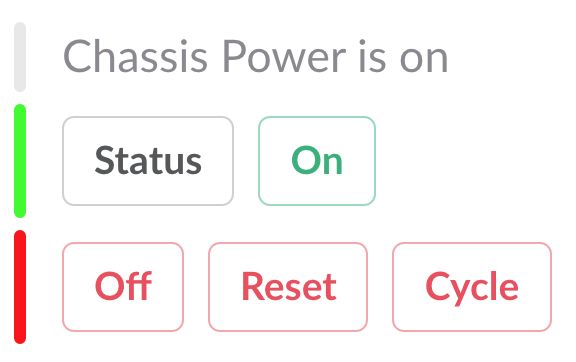
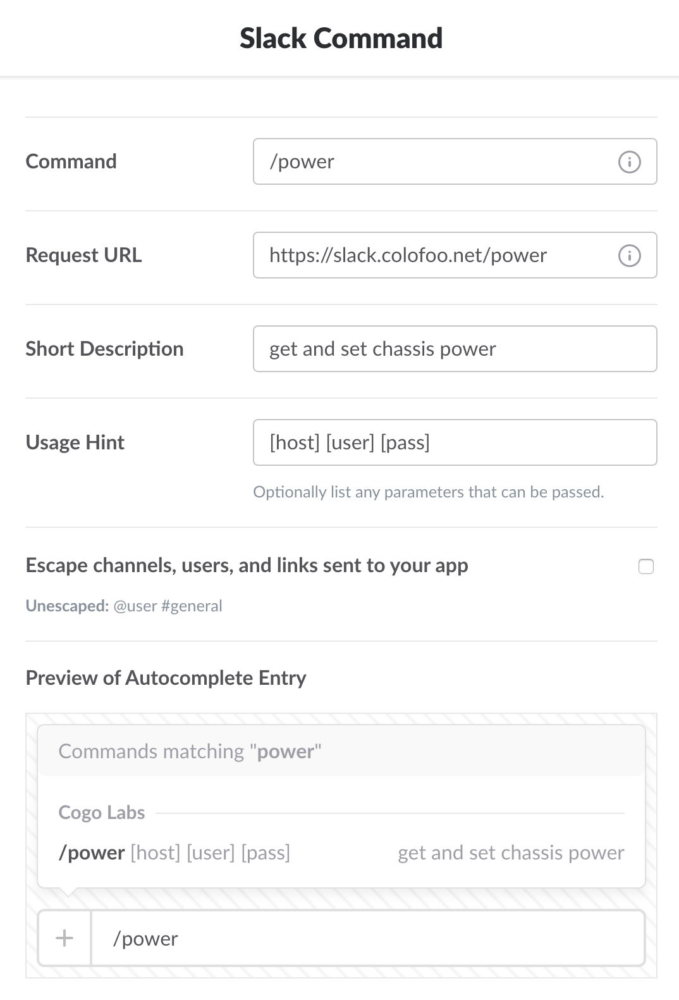

[](https://travis-ci.org/cogolabs/slackipmi)
[](https://hub.docker.com/r/cogolabs/slackipmi/)
[](https://coveralls.io/github/cogolabs/slackipmi?branch=master)
[](https://goreportcard.com/report/github.com/cogolabs/slackipmi)
# slackipmi
reboot servers via IPMI over Slack!
```
~]# docker run cogolabs/slackipmi -h
Usage of /go/bin/slackipmi:
  -base-url string
    	base URL (Slack-accessible) (default "https://slack.colofoo.net")
  -http string
    	 (default ":80")
  -oauth-client-id string
    	Slack-provided client ID
  -oauth-client-secret string
    	Slack-provided client secret
  -slack-team string
    	ignore requests outside your Slack Team (default "myslackorg")
  -slack-token string
    	token verifies reqs are actually coming from Slack (default "V4hafFbeT1doasdfkXeE4f")
```


